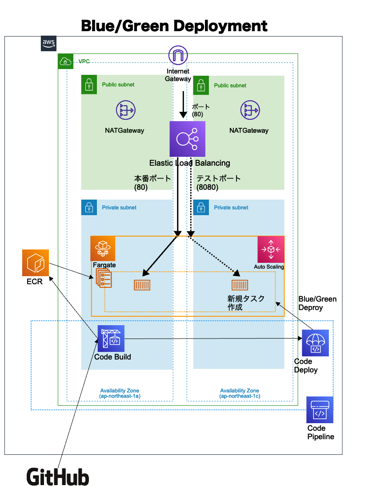

# Fargate CI/CD Pipelineの比較

## 概要

Fargateに対して、Blue/Greenデプロイメントパイプラインを構築するCFnテンプレートを格納しています。  
なお、SourceステージはGitHub、パイプラインはAWS CodePipelineを用いて構築します。

## ファイル構成
```[text]
.
├── README.md
├── cicd-blue-green.yaml // Blue/Green Deploy用のパイプライン構築
├── ecr-blue-green.yaml // Blue/Green Deploy用のECR構築
├── ecs-blue-green.yaml // Blue/Green Deploy用のECS構築
├── vpc.yaml // VPC構築
├── images  // 画像を保存
│   └── BlueGreenDeployment.png
└── parameters // パラメータファイルを保存
    ├── system_dev_cicd-blue-green_parameter.json
    ├── system_dev_ecr-blue-green_parameter.json
    ├── system_dev_ecs-blue-green_parameter.json
    └── system_dev_vpc_parameter.json
```
## 構成図面



## 命名規則

作成リソースは下記命名規則の前提。（vpcを除く）

```[text]
<システム名>-<環境名>-<デプロイ名>
```

## 構築順序

構築順序は下記前提。

- vpc.yaml
- ecr-blue-green.yaml
  - 構築後、latestタグを付与したイメージをpushすること
- ecs-blue-green.yaml
  - vpcの値に合わせてパラメータファイルを更新すること
- cicd-blue-green.yaml
  - vpc・ecsの値に合わせてパラメータファイルを更新すること
  - 初回実行は失敗する。マネジメントコンソールからGitHubとの接続を行なって再度パイプラインを実行すること
  - GitHubのルートディレクトリに下記ファイルが格納されていること。
    - appspec.yaml
    - \<SystemName\>-\<Environment]>-taskdef.json
      - タスクの実行roleを構築したものに変更すること
      - デモではsystem-dev-taskdef.jsonを用意

AWS CLIで下記のコマンドを実行することで、スタックを構築します。

```[shell]
aws cloudformation create-stack \
--stack-name スタック名 \
--template-body file://./テンプレート名 \
--capabilities CAPABILITY_NAMED_IAM \
--parameters file://./parameters/パラメーター名 \
--tags Key=Environment,Value=<Environmentに設定する変数値> \
--tags Key=SystemName,Value=<SystemNameに設定する変数値>
```
